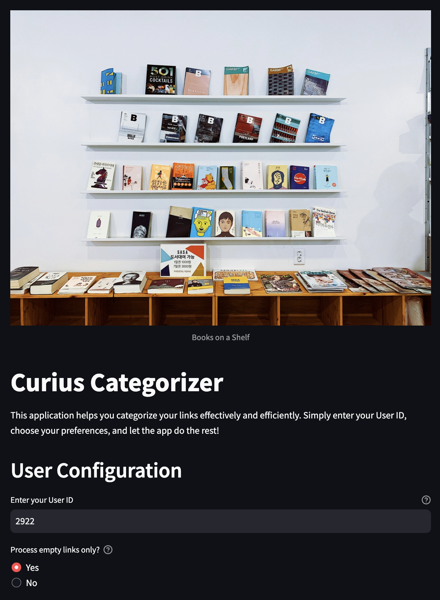

## Curius Categorizer

A small app to help you re-categorize links in Curius.

I find myself usually saving interesting things online but searching back for them is tough because I usually don't tag them.

So I created this to help myself with it.

---

### Examples

### Find your Details

1. Go to your bookshelf
2. Right click > inspect
3. Go to the network tab
4. Find your name (example below)
5. Get the `id` and `authorization token`

### Using the app

